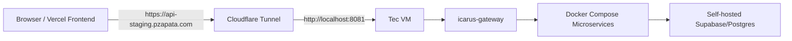
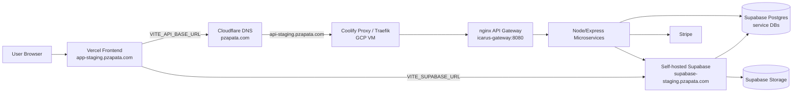
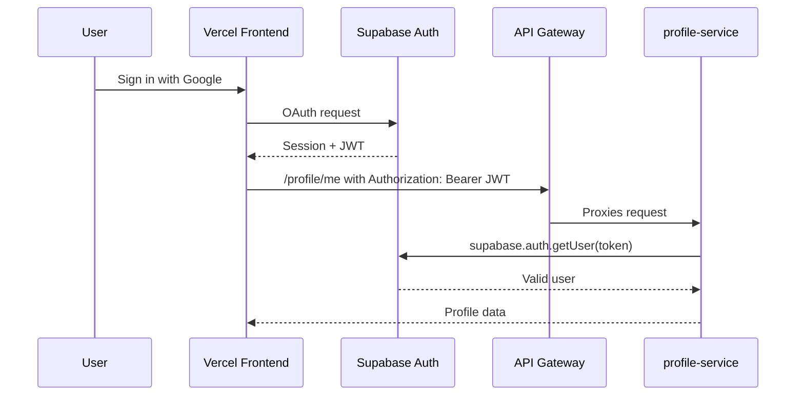

# Sports Engagement Platform Staging Migration Runbook

## 1. Executive Summary

The Sports Engagement Platform staging migration is functionally complete.

The platform was moved away from the Tec VM staging dependency into a GCP VM running Coolify for backend services and self-hosted Supabase. The frontend remains on Vercel, and public DNS remains managed through Cloudflare under `pzapata.com`.

Current staging domains:

```text
Frontend:     https://app-staging.pzapata.com
API Gateway:  https://api-staging.pzapata.com
Supabase:     https://supabase-staging.pzapata.com
```

Current verified working state from the migration:

- HTTPS works.
- Vercel frontend routing works.
- Google OAuth works.
- Supabase JWT validation works.
- The nginx API gateway works.
- Microservices connect correctly to their service databases.
- Profile/Auth works.
- Community works.
- Admin Store works.
- Stripe works.
- New uploads are generated against the new Supabase staging URL.
- Coolify routing works.
- Vercel SPA routing works.

The next phase is not another infrastructure migration. The next phase is:

- final QA,
- cleanup,
- hardening,
- CI/CD,
- monitoring/backups,
- operational documentation,
- and removing obsolete Tec/demo assumptions from day-to-day deployment paths.

## 2. Source Documents Consolidated

This runbook synthesizes the Phase 4 planning and inventory documents under `infra/`. It is not a concatenation. It consolidates the relevant decisions, findings, fixes, and current operating model from:

- `infra/phase-4-target-architecture.md`
- `infra/supabase-runtime-inventory.md`
- `infra/supabase-runtime-export-checklist.md`
- `infra/phase-4-runtime-export-execution-plan.md`
- `infra/phase-4-live-runtime-findings.md`
- `infra/phase-4-findings-analysis.md`
- `infra/vercel-staging-setup.md`
- `infra/phase-4-gateway-public-exposure.md`
- `infra/railway-staging-feasibility.md`
- `infra/phase-4-2-coolify-traefik-api-exposure.md`
- `infra/phase-4-current-state-and-target-architecture.md`
- `infra/phase-4-supabase-cloud-migration-assessment.md`
- `infra/phase-4-vps-coolify-migration-plan.md`
- `infra/README.md`

It also records current operator-confirmed staging fixes that happened after the early Phase 4 planning docs were written.

## 3. Original Problem And Migration Motivation

The original staging environment depended on the Tec VM. The application stack, self-hosted Supabase, and supporting infrastructure were concentrated on that host. This created several operational problems:

- The frontend needed a public API, but the Tec VM was behind network constraints.
- Direct public Coolify/Traefik exposure from the Tec environment was unreliable.
- Cloudflare Tunnel made the old stack reachable, but it was a temporary bridge, not a migration target.
- Supabase public URLs were tied to `nip.io` and a private Tec IP.
- OAuth/Auth callback settings were tied to old hostnames and local development URLs.
- Backend services and Supabase relied on Docker-internal network names.
- New services and deploys were hard to manage without a clearer backend hosting target.
- CI/CD could not be completed cleanly while the Tec VM was the central staging dependency.

The migration objective was to keep the existing product architecture while removing the Tec VM dependency:

- preserve React + Vite frontend,
- preserve nginx API gateway,
- preserve Node/Express microservices,
- preserve self-hosted Supabase,
- preserve separate service databases,
- preserve Stripe-backed Store/Admin Store behavior,
- and move staging to stable GCP/Coolify/Vercel infrastructure.

## 4. Initial Architecture / Tec Environment Limitations

The early Phase 4 staging bridge looked like this:



This solved immediate browser reachability but did not solve the real migration problem.

Important limitations:

- The API still depended on the Tec VM.
- Cloudflare Tunnel was a staging bridge, not the final hosting model.
- Supabase still used Tec-era public URLs such as `http://supabase.10.14.255.82.nip.io`.
- OAuth callback URLs were coupled to the old Supabase host.
- The Postgres database was internal-only to the old Docker network.
- New product/image URLs generated from Supabase Storage could inherit the old public URL.
- Backend deploys were not yet automated from GitHub.
- Adding services still increased load and complexity on the same constrained environment.

## 5. Target Staging Architecture

The selected target was a new GCP VM running Coolify, not Supabase Cloud and not Railway for the immediate backend migration.

Why not Supabase Cloud right now:

- The current backend uses multiple service-specific PostgreSQL databases.
- Supabase Cloud is organized around a project database.
- Moving to Supabase Cloud would require schema consolidation or a different data model.
- That would increase migration risk and could break the current microservice/database architecture.

Why not Railway as the first backend staging target:

- Gateway-only Railway deployment was not viable because nginx upstreams use internal service DNS names.
- Railway cannot resolve the current Docker Compose service names unless the relevant services are also deployed there.
- The useful backend services require database access.
- At the time of analysis, the self-hosted Supabase/Postgres database was not externally reachable in a production-ready way.

Chosen target:

```text
Frontend:         Vercel
DNS:              Cloudflare / pzapata.com
Backend runtime:  Coolify on GCP VM
API gateway:      nginx gateway
Services:         Node/Express microservices
Database/Auth:    self-hosted Supabase on the same GCP/Coolify environment
Storage:          self-hosted Supabase Storage
Payments:         Stripe
```

## 6. Final Deployed Architecture

Current staging flow:



Public staging domains:

```text
app-staging.pzapata.com      -> Vercel
api-staging.pzapata.com      -> Coolify/Traefik -> nginx gateway
supabase-staging.pzapata.com -> Coolify/Traefik -> Supabase Kong/public API
```

The backend and Supabase run on the GCP VM in Coolify-managed Docker environments. The app compose stack joins the existing Supabase Docker network so services can use internal database hostnames such as:

```text
supabase-db
```

The current GCP Supabase Docker network is environment-specific and configured through:

```text
SUPABASE_DOCKER_NETWORK=<GCP_SUPABASE_DOCKER_NETWORK_NAME>
```

For the current staging server, the known network name is:

```text
t12kj96qa1mc5j0m8gp9if5k
```

This is not a secret, but it is environment-specific and should remain in deployment configuration, not business logic.

## 7. GCP VM Role And Assumptions

The GCP VM is the staging backend host.

Responsibilities:

- run Coolify,
- run Coolify proxy/Traefik,
- run the self-hosted Supabase stack,
- run the app Docker Compose stack,
- provide Docker networking between app services and Supabase,
- terminate or route HTTPS through Coolify/Traefik,
- host logs and runtime container state,
- support backend redeploys from GitHub through Coolify.

Assumptions to verify in operations:

- The VM has enough CPU/RAM/disk for Supabase plus all services.
- Inbound 80/443 are open.
- SSH access is restricted and controlled.
- Docker disk usage is monitored.
- Backups exist for Postgres dumps and Supabase Storage objects.
- Coolify has GitHub access configured.
- Cloudflare DNS records point to the correct GCP/Coolify target.

Recommended operational checks:

```bash
docker ps
docker network ls
docker volume ls
df -h
free -h
```

## 8. Coolify Configuration And Role

Coolify is the runtime manager for the backend and Supabase staging deployments.

Coolify is responsible for:

- pulling/building the repository,
- running the app Docker Compose stack from `infra/docker-compose.yml`,
- injecting environment variables,
- exposing selected services through its proxy,
- routing public domains to internal container ports,
- issuing/serving HTTPS certificates through its proxy layer,
- redeploying services when GitHub changes are deployed.

Current app import settings:

```text
Base Directory: infra
Compose file: docker-compose.yml
```

Important compose behavior:

- Supabase is not deployed by the app compose file.
- Supabase is deployed separately in Coolify.
- The app compose joins the existing Supabase Docker network using:

  ```yaml
  networks:
    supabase_net:
      external: true
      name: ${SUPABASE_DOCKER_NETWORK}
  ```

This allows app service DB URLs such as:

```text
postgresql://matches_svc:<password>@supabase-db:5432/matches_db
```

Coolify routing must target internal container ports, not old host-published Tec ports:

```text
api-staging.pzapata.com      -> icarus-gateway:8080
supabase-staging.pzapata.com -> Supabase Kong/public API
```

### Domain Rule Fix

During migration, Coolify domains initially generated invalid `Host(\`\`)` Traefik/Caddy-style routing rules. The fix was to recreate the domains correctly in Coolify so the router rules contained the real hostnames.

Current expected result:

- no empty Host rules,
- `api-staging.pzapata.com` routes to the gateway,
- `supabase-staging.pzapata.com` routes to Supabase,
- HTTPS certificates are valid.

If a domain returns a routing error after redeploy, check generated Coolify proxy labels/rules before changing application code.

## 9. Supabase Self-Hosted Configuration

Supabase remains self-hosted.

Self-hosted Supabase includes:

- Kong/public API,
- GoTrue/Auth,
- PostgREST,
- Storage API,
- Realtime,
- Studio,
- Supavisor/pooler where configured,
- Postgres,
- object storage backend such as MinIO,
- supporting analytics/logging containers depending on the Coolify template.

Public staging URL:

```text
https://supabase-staging.pzapata.com
```

Critical Supabase public URL settings:

```text
SERVICE_URL_SUPABASEKONG=https://supabase-staging.pzapata.com
SUPABASE_PUBLIC_URL=${SERVICE_URL_SUPABASEKONG}
STORAGE_PUBLIC_URL=${SERVICE_URL_SUPABASEKONG}
API_EXTERNAL_URL=https://supabase-staging.pzapata.com
NEXT_PUBLIC_SUPABASE_URL=${SERVICE_URL_SUPABASEKONG}
```

Some templates may use slightly different variable names. The key requirement is that all browser-facing Supabase, Auth, and Storage URLs resolve to:

```text
https://supabase-staging.pzapata.com
```

Do not use:

```text
localhost
127.0.0.1
nip.io
sslip.io
trycloudflare.com
Tec private IPs
```

for staging public Supabase URLs.

### Supabase Runtime Checks

Safe checks:

```bash
curl -i https://supabase-staging.pzapata.com/auth/v1/health
curl -i https://supabase-staging.pzapata.com/storage/v1/
```

Container-level checks on the GCP VM:

```bash
docker ps | grep -i supabase
docker logs <supabase-kong-container> --tail=100
docker logs <supabase-auth-container> --tail=100
docker logs <supabase-storage-container> --tail=100
```

Never paste service role keys, JWT secrets, database passwords, OAuth client secrets, or SMTP passwords into logs, screenshots, or docs.

## 10. API Gateway Configuration

The public API entrypoint is the nginx gateway.

Public URL:

```text
https://api-staging.pzapata.com
```

Internal target:

```text
icarus-gateway:8080
```

The gateway proxies routes to Compose service DNS names, for example:

```text
/matches/     -> matches-service:4002
/profile/     -> profile-service:4006
/community/   -> community-service:4001
/store/       -> store-service:4005
/admin-store/ -> admin-store-service:4013
```

The gateway is intentionally kept in place. It remains the central API surface for the frontend.

### CORS

The staging frontend origin is:

```text
https://app-staging.pzapata.com
```

Gateway CORS must allow that exact origin.

Current gateway config also includes some development/temporary patterns such as localhost and temporary tunnel/domain patterns. Those are not ideal for long-term hardening, but they are not the next migration blocker.

Hardening task:

- keep `https://app-staging.pzapata.com`,
- add production frontend origin when production exists,
- remove broad `nip.io`, `sslip.io`, and `trycloudflare.com` allowances after QA confirms they are no longer needed.

### Gateway Validation

Safe checks:

```bash
curl -i https://api-staging.pzapata.com/matches/
curl -i https://api-staging.pzapata.com/store/health
curl -i https://api-staging.pzapata.com/profile/health
curl -i -H "Origin: https://app-staging.pzapata.com" https://api-staging.pzapata.com/matches/
```

Expected CORS response includes:

```text
Access-Control-Allow-Origin: https://app-staging.pzapata.com
Vary: Origin
```

## 11. Vercel Frontend Configuration

The frontend is the React + Vite app in:

```text
apps/web
```

Vercel project settings:

```text
Root Directory: apps/web
Build Command: npm run build
Output Directory: dist
Install Command: npm install
```

Required staging environment variables:

```text
VITE_API_BASE_URL=https://api-staging.pzapata.com
VITE_SUPABASE_URL=https://supabase-staging.pzapata.com
VITE_SUPABASE_PUBLISHABLE_DEFAULT_KEY=<SUPABASE_STAGING_ANON_OR_PUBLISHABLE_KEY>
VITE_SUPABASE_FEEDBACK_BUCKET=feedback-images
```

Optional:

```text
VITE_ELEVENLABS_AGENT_ID=<OPTIONAL>
```

Do not set backend-only secrets in Vercel:

- `SUPABASE_SERVICE_KEY`
- database URLs,
- database passwords,
- Stripe secret key,
- OAuth client secret,
- JWT secret,
- SMTP credentials.

### Vercel SPA Routing

Vercel SPA routing was fixed with:

```text
apps/web/vercel.json
```

Current rewrite:

```json
{
  "rewrites": [
    {
      "source": "/(.*)",
      "destination": "/"
    }
  ]
}
```

This ensures direct refreshes and deep links route back to the Vite SPA instead of returning Vercel 404s.

## 12. Domain And DNS Setup

DNS is managed through Cloudflare for `pzapata.com`.

Current staging domains:

```text
app-staging.pzapata.com
api-staging.pzapata.com
supabase-staging.pzapata.com
```

Ownership:

```text
app-staging.pzapata.com      -> Vercel
api-staging.pzapata.com      -> GCP VM / Coolify proxy
supabase-staging.pzapata.com -> GCP VM / Coolify proxy
```

DNS and proxy behavior should be kept simple:

- use stable `pzapata.com` subdomains,
- avoid `nip.io` and `sslip.io` for staging,
- avoid Cloudflare Tunnel as the final staging path,
- keep TTL low during migration changes,
- verify certificate issuance after each domain change.

Safe checks:

```bash
nslookup app-staging.pzapata.com
nslookup api-staging.pzapata.com
nslookup supabase-staging.pzapata.com
```

## 13. HTTPS / Traefik / Routing Fixes

The final staging setup depends on HTTPS for:

- browser security,
- Supabase Auth,
- Google OAuth callback handling,
- Storage public URLs,
- frontend API calls,
- Stripe redirect flows.

Important fixes completed:

- Coolify domain rules were recreated after invalid empty host rules were generated.
- `api-staging.pzapata.com` now routes to the gateway.
- `supabase-staging.pzapata.com` now routes to Supabase.
- Supabase public URL variables were corrected away from old Tec/nip.io URLs.
- Google OAuth callback was corrected to the staging Supabase HTTPS domain.
- Vercel frontend uses HTTPS staging origins.

If a route breaks:

1. Confirm DNS points to the correct target.
2. Confirm Coolify domain exists and has a non-empty host rule.
3. Confirm certificate status.
4. Confirm internal target port.
5. Confirm container is running.
6. Only then inspect application logs.

## 14. Environment Variable Strategy

The migration goal is environment-driven configuration, not hardcoded provider assumptions.

### Frontend / Vercel

Use only frontend-safe variables:

```text
VITE_API_BASE_URL=https://api-staging.pzapata.com
VITE_SUPABASE_URL=https://supabase-staging.pzapata.com
VITE_SUPABASE_PUBLISHABLE_DEFAULT_KEY=<PUBLIC_ANON_KEY>
VITE_SUPABASE_FEEDBACK_BUCKET=feedback-images
```

### Backend App Compose / Coolify

Use backend-only Coolify environment variables:

```text
SUPABASE_DOCKER_NETWORK=<GCP_SUPABASE_DOCKER_NETWORK_NAME>

SUPABASE_URL=https://supabase-staging.pzapata.com
SUPABASE_ANON_KEY=<SUPABASE_ANON_KEY>
SUPABASE_SERVICE_KEY=<SUPABASE_SERVICE_ROLE_KEY>

PROFILE_DB_URL=postgresql://profile_svc:<password>@supabase-db:5432/profile_db
COMMUNITY_DB_URL=postgresql://community_svc:<password>@supabase-db:5432/community_db
MATCHES_DB_URL=postgresql://matches_svc:<password>@supabase-db:5432/matches_db
ROOMS_DB_URL=postgresql://rooms_svc:<password>@supabase-db:5432/rooms_db
ANALYTICS_DB_URL=postgresql://analytics_svc:<password>@supabase-db:5432/analytics_db
HISTORY_DB_URL=postgresql://history_svc:<password>@supabase-db:5432/history_db
CARDS_DB_URL=postgresql://cards_svc:<password>@supabase-db:5432/cards_db
OFFSEASON_DB_URL=postgresql://offseason_svc:<password>@supabase-db:5432/offseason_db
NEWS_DB_URL=postgresql://news_svc:<password>@supabase-db:5432/news_cache
FEEDBACKMAIL_DB_URL=postgresql://feedback_svc:<password>@supabase-db:5432/feedback_db

STRIPE_SECRET_KEY=<STRIPE_SECRET_KEY>
STRIPE_WEBHOOK_SECRET=<STRIPE_WEBHOOK_SECRET>
FRONTEND_URL=https://app-staging.pzapata.com

GETXAPI_KEY=<GETXAPI_KEY>
NEWS_API_KEY=<NEWS_API_KEY>
OPENAI_API_KEY=<OPTIONAL_OPENAI_API_KEY>
```

### Supabase Runtime / Coolify

Representative public/runtime variables:

```text
SERVICE_URL_SUPABASEKONG=https://supabase-staging.pzapata.com
SUPABASE_PUBLIC_URL=${SERVICE_URL_SUPABASEKONG}
STORAGE_PUBLIC_URL=${SERVICE_URL_SUPABASEKONG}
API_EXTERNAL_URL=https://supabase-staging.pzapata.com
GOTRUE_SITE_URL=https://app-staging.pzapata.com
ADDITIONAL_REDIRECT_URLS=https://app-staging.pzapata.com,https://app-staging.pzapata.com/auth/callback,http://localhost:5173
GOOGLE_CALLBACK_URI=https://supabase-staging.pzapata.com/auth/v1/callback
ENABLE_GOOGLE_SIGNUP=true
ENABLE_EMAIL_SIGNUP=true
```

Some Supabase templates use different names. The rule is:

- public API/Auth/Storage URLs must point at `https://supabase-staging.pzapata.com`,
- frontend site/redirect URLs must point at `https://app-staging.pzapata.com`,
- internal DB access should use `supabase-db:5432`,
- secrets stay in Coolify/Vercel secret stores, not repo files.

## 15. Database Connectivity Strategy

The app preserves separate service databases.

Active DB URL variables:

| Service | Env var | Database host pattern |
| --- | --- | --- |
| profile-service | `PROFILE_DB_URL` | `supabase-db:5432/profile_db` |
| community-service | `COMMUNITY_DB_URL` | `supabase-db:5432/community_db` |
| matches-service | `MATCHES_DB_URL` | `supabase-db:5432/matches_db` |
| rooms-service | `ROOMS_DB_URL` | `supabase-db:5432/rooms_db` |
| analytics-service | `ANALYTICS_DB_URL` | `supabase-db:5432/analytics_db` |
| history-service | `HISTORY_DB_URL` | `supabase-db:5432/history_db` |
| cards-service | `CARDS_DB_URL` | `supabase-db:5432/cards_db` |
| offseason-service | `OFFSEASON_DB_URL` | `supabase-db:5432/offseason_db` |
| news-service | `NEWS_DB_URL` | `supabase-db:5432/news_cache` |
| feedback-service | `FEEDBACKMAIL_DB_URL` | `supabase-db:5432/feedback_db` |

Legacy/unused:

- `STORE_DB_URL` is not used by the current Store service.
- `AUTH_DB_URL` is not used by the current app services.

Important deployment detail:

- The app Docker Compose stack must join the Supabase Docker network.
- DB URLs should use `supabase-db`.
- Do not use `host.docker.internal`, localhost, Tec container names, or old network-specific container names in staging.

Validation:

```bash
docker exec icarus-matches printenv MATCHES_DB_URL
docker exec icarus-profile printenv PROFILE_DB_URL
curl -i https://api-staging.pzapata.com/matches/health
curl -i https://api-staging.pzapata.com/profile/health
```

Do not print full DB URLs in public channels because they contain passwords.

## 16. Storage / Uploads Strategy

Supabase Storage is used by:

| Bucket | Used by | Notes |
| --- | --- | --- |
| `avatars` | Profile avatar uploads | Generated public URL is stored in profile DB. |
| `feedback-images` | Feedback image uploads | Generated public URLs are stored with feedback records. |
| `store-images` | Admin Store product image uploads | Generated public URL is saved into Stripe product images. |

Public object URLs are generated by Supabase client calls such as:

```text
supabase.storage.from(<bucket>).getPublicUrl(<path>)
```

The generated URL uses the configured Supabase public URL. Therefore:

- if `SUPABASE_URL` points to the old Tec/nip.io host, new Admin Store product images will use the old host;
- if `VITE_SUPABASE_URL` points to the old host, frontend-generated avatar/feedback URLs will use the old host;
- if Supabase runtime public URL settings point to the old host, Storage can still generate old URLs.

Current expected staging URL prefix:

```text
https://supabase-staging.pzapata.com/storage/v1/object/public/
```

Admin Store image uploads were fixed by ensuring the deployed `admin-store-service` uses:

```text
SUPABASE_URL=https://supabase-staging.pzapata.com
```

New uploads now generate new Supabase staging URLs.

## 17. OAuth Google Configuration

Google OAuth is handled through Supabase Auth.

Required settings:

```text
ENABLE_GOOGLE_SIGNUP=true
GOOGLE_CALLBACK_URI=https://supabase-staging.pzapata.com/auth/v1/callback
GOTRUE_SITE_URL=https://app-staging.pzapata.com
```

Allowed redirect URLs should include:

```text
https://app-staging.pzapata.com
https://app-staging.pzapata.com/auth/callback
```

Optional local development redirect:

```text
http://localhost:5173
```

Google Cloud Console OAuth client must include:

```text
https://supabase-staging.pzapata.com/auth/v1/callback
```

Important fix completed:

- old callback values pointing to `http://supabase.10.14.255.82.nip.io/auth/v1/callback` were replaced with the staging Supabase HTTPS callback.
- `ENABLE_GOOGLE_SIGNUP=true` was required for Google OAuth to work.

## 18. JWT Authentication Flow

Authentication flow:



The profile service validates JWTs using:

```text
SUPABASE_URL
SUPABASE_ANON_KEY
```

Current known working state:

- OAuth login works.
- JWT validation works.
- Profile/Auth works.

Important fix:

- `POST /profile/new/user` was made idempotent using `ON CONFLICT (user_id)`, fixing 409 conflicts when OAuth users logged in repeatedly or already had a profile row.

Operational note:

- The `accounts.user_id` unique constraint is required for that idempotent behavior. Verify it exists in restored databases.

## 19. Stripe Configuration Notes

Stripe is used by:

- `store-service` for product listing and checkout creation,
- `admin-store-service` for product administration and image-backed Stripe products,
- Stripe webhooks through the admin store service route.

Backend-only variables:

```text
STRIPE_SECRET_KEY=<STRIPE_SECRET_KEY>
STRIPE_WEBHOOK_SECRET=<STRIPE_WEBHOOK_SECRET>
FRONTEND_URL=https://app-staging.pzapata.com
```

Frontend must not receive Stripe secret keys.

The Store checkout flow depends on `FRONTEND_URL` for success/cancel redirects if the frontend does not send an origin.

Current known working state:

- Store works.
- Admin Store works.
- Stripe works.
- New Admin Store uploads generate new Supabase staging URLs.

## 20. Important Bugs Encountered And Fixes

### Invalid Coolify Domain Rules

Problem:

- Coolify generated invalid empty host rules such as `Host(\`\`)`.

Fix:

- Recreated the domains correctly in Coolify.

Result:

- `api-staging.pzapata.com` and `supabase-staging.pzapata.com` route correctly.

### Supabase Public URLs Still Pointed To Old Tec Host

Problem:

- Supabase runtime and app envs still referenced old Tec/nip.io URLs.

Fix:

- Updated public Supabase values to `https://supabase-staging.pzapata.com`.
- Corrected Google callback URI.

Result:

- OAuth and Storage URL generation use the staging domain.

### Google OAuth Failed Until Signup/Callback Were Correct

Problem:

- Google OAuth required the correct Supabase callback and provider enablement.

Fix:

```text
ENABLE_GOOGLE_SIGNUP=true
GOOGLE_CALLBACK_URI=https://supabase-staging.pzapata.com/auth/v1/callback
```

Result:

- Google OAuth works.

### Profile Creation Returned 409

Problem:

- Some OAuth users authenticated successfully but `/profile/me` returned 404.
- `POST /profile/new/user` sometimes returned 409.
- Some users worked only because they already had a row in `profile_db.accounts`.

Fix:

- Made `/profile/new/user` idempotent using `ON CONFLICT (user_id)`.
- Existing user rows are returned/updated instead of treating repeated profile sync as a failure.

Result:

- OAuth login can create or return a profile.

### Community Reply Creation Logged "Missing user id in session"

Problem:

- Community comment/reply creation could fail before the API request.
- The frontend read `session.user.id` from AuthContext, but after OAuth redirect the Supabase session could exist before context had fully caught up.

Fix:

- Community new-post and new-reply handlers now fall back to:

  ```text
  supabase.auth.getSession()
  ```

Result:

- Community post/comment creation works after migration.

### Community DB Trigger Was Missing `RETURN NEW`

Problem:

- The database trigger `function_update_replies_count()` was missing `RETURN NEW`.

Fix:

- Fixed manually in the database.

Operational note:

- This fix should be captured in a future schema migration or DB restore checklist. Verify the trigger function definition after any DB restore.

### Vercel SPA Routing Failed On Direct Routes

Problem:

- Direct navigation/refreshes on frontend routes could fail because Vercel needed SPA rewrites.

Fix:

- Added `apps/web/vercel.json` rewrite to `/`.

Result:

- Vercel SPA routing works.

### Admin Store Used Relative Fetches

Problem:

- Admin Store frontend calls used relative paths like `/admin-store/products`.
- In Vercel, those could resolve against the frontend origin instead of the API gateway.

Fix:

- Admin Store frontend calls were migrated to the shared `apiFetch` helper.

Result:

- With `VITE_API_BASE_URL=https://api-staging.pzapata.com`, Admin Store requests go through the gateway.

### New Admin Store Uploads Used Old Supabase URL

Problem:

- New product image URLs still pointed to old `nip.io` Supabase URLs.

Cause:

- `admin-store-service` generates public image URLs through Supabase JS using `SUPABASE_URL`.

Fix:

- Set deployed `admin-store-service` env:

  ```text
  SUPABASE_URL=https://supabase-staging.pzapata.com
  ```

Result:

- New Admin Store uploads generate staging Supabase URLs.

## 21. Legacy Data Issue With Old Nip.io URLs

Some old records may still point to old Tec/nip.io Supabase URLs.

Known affected surfaces:

- old Stripe product image URLs,
- old feedback image URLs,
- potentially old profile avatar URLs.

Decision:

- Do not manually migrate legacy Stripe products and old feedback images right now.
- Delete/recreate through the app where practical.
- Keep manual URL rewrite as a later cleanup option only if the product team decides old assets must be preserved.

Reason:

- The infrastructure migration is already functional.
- New uploads work correctly.
- Manual legacy URL rewriting across Stripe, feedback rows, and profile data has higher risk than value for staging.

If legacy migration becomes required later:

1. Inventory old URLs.
2. Confirm objects exist in new storage.
3. Rewrite records in a controlled script.
4. Validate every affected UI.
5. Keep a backup of pre-rewrite data.

## 22. Current Known Working State

As of this runbook:

- Frontend loads at `https://app-staging.pzapata.com`.
- API works at `https://api-staging.pzapata.com`.
- Supabase works at `https://supabase-staging.pzapata.com`.
- HTTPS is valid.
- OAuth Google works.
- JWT auth works.
- Gateway works.
- Microservices connect to their DBs.
- Profile/Auth works.
- Community works.
- Admin Store works.
- Stripe works.
- New uploads use new Supabase staging URLs.
- Coolify routing works.
- Vercel SPA routing works.

This means the core infrastructure migration is complete enough to move to QA, cleanup, hardening, and CI/CD.

## 23. Final QA Checklist

### Frontend

- [ ] `https://app-staging.pzapata.com` loads.
- [ ] Direct refresh works on nested routes.
- [ ] Browser network calls use `https://api-staging.pzapata.com`.
- [ ] Browser Supabase calls use `https://supabase-staging.pzapata.com`.
- [ ] No browser request uses localhost, `nip.io`, `sslip.io`, or old Tec IPs.

### Auth/Profile

- [ ] Google OAuth login works.
- [ ] Email/password login works if enabled.
- [ ] JWT-protected `/profile/me` works.
- [ ] New OAuth user gets profile row.
- [ ] Existing OAuth user can log in repeatedly.
- [ ] Avatar upload works.

### Community

- [ ] Community page loads posts.
- [ ] Create post works.
- [ ] Create reply/comment works.
- [ ] Reply count updates correctly.
- [ ] `function_update_replies_count()` still returns `NEW` after restore/redeploy.

### Store/Admin Store

- [ ] Store products load.
- [ ] Checkout session creates correctly.
- [ ] Stripe success/cancel redirects go to `app-staging.pzapata.com`.
- [ ] Admin Store product list loads.
- [ ] Admin Store product creation works.
- [ ] Admin Store image upload creates `https://supabase-staging.pzapata.com/...` URLs.
- [ ] Stripe webhook route is configured if webhook testing is in scope.

### Supabase Storage

- [ ] `avatars` bucket exists.
- [ ] `feedback-images` bucket exists.
- [ ] `store-images` bucket exists.
- [ ] Bucket policies allow expected staging behavior.
- [ ] New public URLs use `supabase-staging.pzapata.com`.

### Gateway

- [ ] `/matches/` works.
- [ ] `/profile/health` works.
- [ ] `/store/health` works.
- [ ] `/community/get_posts` works.
- [ ] `/admin-store/products` works through the gateway.
- [ ] CORS allows `https://app-staging.pzapata.com`.
- [ ] Preflight OPTIONS works where needed.

### Backend Services

- [ ] `matches-service` health/API works.
- [ ] `profile-service` health/API works.
- [ ] `community-service` health/API works.
- [ ] `store-service` health/API works.
- [ ] `admin-store-service` health/API works.
- [ ] Remaining services are checked according to product scope.

## 24. Redeploy Process

### Frontend Redeploy

Use Vercel.

Typical process:

1. Merge frontend changes.
2. Vercel builds from `apps/web`.
3. Confirm env vars are present:

   ```text
   VITE_API_BASE_URL
   VITE_SUPABASE_URL
   VITE_SUPABASE_PUBLISHABLE_DEFAULT_KEY
   VITE_SUPABASE_FEEDBACK_BUCKET
   ```

4. Validate the deployed URL.

Safe local build check:

```bash
cd apps/web
npm install
npm run build
```

### Backend Redeploy

Use Coolify.

Typical process:

1. Confirm backend env vars are set in Coolify.
2. Confirm `SUPABASE_DOCKER_NETWORK` points to the active Supabase network.
3. Deploy app compose from `infra/docker-compose.yml`.
4. Verify containers.
5. Verify gateway/API.

Safe checks on the GCP VM:

```bash
docker ps
docker logs icarus-gateway --tail=100
docker logs icarus-profile --tail=100
docker logs icarus-community --tail=100
docker logs icarus-admin-store --tail=100
```

Safe API checks:

```bash
curl -i https://api-staging.pzapata.com/matches/
curl -i https://api-staging.pzapata.com/store/health
curl -i https://api-staging.pzapata.com/profile/health
```

### Supabase Redeploy / Config Change

Supabase changes are higher risk than app service changes.

Before changing Supabase:

- export current env/config,
- confirm backups,
- record current working OAuth settings,
- record current public URL settings,
- avoid changing JWT secrets unless a deliberate session invalidation is planned.

After changing Supabase:

```bash
curl -i https://supabase-staging.pzapata.com/auth/v1/health
```

Then test:

- Google OAuth,
- profile JWT validation,
- Storage upload,
- public object URL generation.

## 25. Rollback / Recovery Process

### Frontend Rollback

Rollback options:

- Use Vercel previous deployment rollback.
- Restore prior Vercel env values if an env change caused the issue.
- Rebuild from last known-good commit.

Primary frontend env rollback values should still point to staging domains, not localhost or `nip.io`.

### Backend Rollback

Rollback options:

- Redeploy previous Git commit in Coolify.
- Revert recent environment variable changes in Coolify.
- Restart affected service only if the issue is isolated.
- Avoid restarting Supabase unless the issue is Supabase-specific.

Check logs before rollback:

```bash
docker logs <container> --tail=200
```

### Database Recovery

Use verified backups/dumps.

Recovery approach:

1. Stop writes if data consistency matters.
2. Take a fresh backup before destructive recovery if possible.
3. Restore only the affected service DB where practical.
4. Validate row counts and service health.
5. Re-enable traffic.

Do not make ad hoc production/staging data edits without recording them.

The manually fixed Community trigger should be included in future DB restore verification:

```text
function_update_replies_count()
```

Expected behavior:

- trigger function returns `NEW`,
- reply count updates after insert.

### Supabase Auth Recovery

If OAuth breaks:

1. Check `supabase-staging.pzapata.com` HTTPS.
2. Check `GOOGLE_CALLBACK_URI`.
3. Check Google Cloud Console authorized redirect URI.
4. Check `GOTRUE_SITE_URL`.
5. Check allowed redirect URLs.
6. Check `ENABLE_GOOGLE_SIGNUP=true`.
7. Check Auth container logs.

Do not rotate JWT secrets as a quick fix.

### Storage Recovery

If uploads generate the wrong host:

1. Check frontend `VITE_SUPABASE_URL`.
2. Check backend `SUPABASE_URL`.
3. Check Supabase `SUPABASE_PUBLIC_URL` / Storage public URL settings.
4. Redeploy affected service.
5. Upload a new object and inspect the generated URL.

Existing wrong URLs may be legacy data and not a current upload bug.

## 26. Operational Notes For Future Maintainers

- The GCP/Coolify staging environment is now the active backend/Supabase staging target.
- The Tec VM and Cloudflare Tunnel path were migration bridges and should not be revived as normal staging architecture.
- Keep public domains stable:
  - `app-staging.pzapata.com`
  - `api-staging.pzapata.com`
  - `supabase-staging.pzapata.com`
- Keep secrets in Coolify/Vercel, not in repo files.
- Do not expose Supabase service role keys to the frontend.
- Keep service DB URLs internal to Docker networking.
- Use `supabase-db:5432` for app service DB connectivity.
- Use the gateway for frontend API calls.
- Use `apiFetch` for frontend backend calls so `VITE_API_BASE_URL` is respected.
- Use Supabase client for Auth and Storage only with frontend-safe public key.
- Treat old `nip.io` URLs as legacy data unless new uploads still generate them.
- Record manual DB fixes in migration scripts/checklists before any future restore.

## 27. Remaining Pending Work

### Cleanup

- Remove or quarantine old Tec/demo docs and `nginx-demo.conf` when the team is comfortable.
- Remove broad gateway CORS allowlist entries for `nip.io`, `sslip.io`, and tunnel domains after QA.
- Update older planning docs or mark them superseded by this runbook.
- Remove stale local env values from developer machines, especially old Supabase URLs.

### Final QA

- Complete the QA checklist in this runbook.
- Test all user-facing flows on `app-staging.pzapata.com`.
- Confirm mobile and desktop behavior.
- Confirm all browser requests use staging domains.

### CI/CD

- Frontend:
  - Vercel deploys from GitHub.
  - PR previews should be enabled if useful.
  - `main` should deploy the agreed staging/production target.

- Backend:
  - Coolify should deploy from GitHub.
  - Start with manual deploy approval.
  - Move to merge-to-main deploy after rollback is tested.

- Suggested checks before auto-deploy:
  - frontend build,
  - Docker Compose config validation,
  - gateway nginx config test,
  - service build checks,
  - basic smoke tests,
  - secret scan.

### Hardening

- Tighten CORS.
- Add monitoring/alerts.
- Verify backups and restore drills.
- Document Supabase backup and Storage object backup.
- Document Stripe webhook setup.
- Add database schema migration tracking for manual DB fixes.
- Review any remaining debug endpoints, especially profile/debug routes.
- Confirm no real secrets are committed or exposed in frontend envs.

### Production Planning

Staging is functional. Production should not be created by copying stale Tec-era assumptions.

Production should use:

- production-specific domains,
- production-specific Supabase secrets,
- production-specific Stripe credentials,
- production-specific DB backups,
- explicit rollback plan,
- final CORS/domain hardening,
- and documented cutover criteria.
